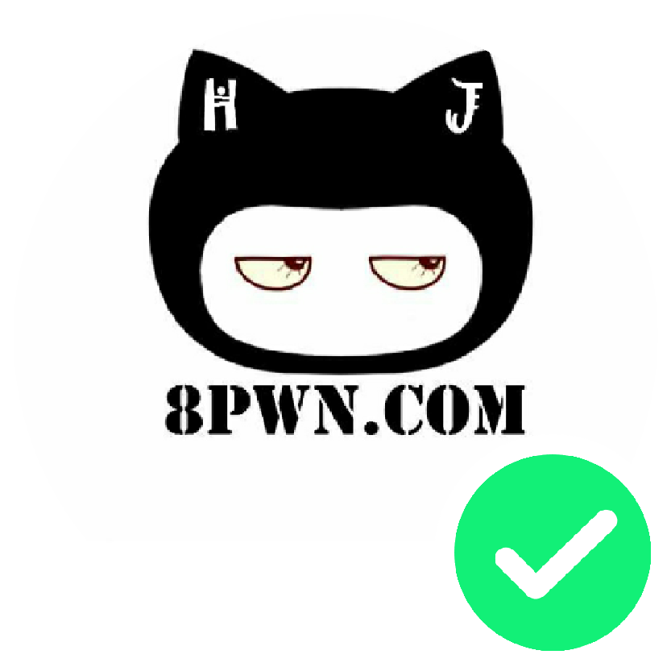

# 功能简介

### 自动化修改微信头像已达到修改微信头像，实现在线离线状态

### 

### 

### 

### 

### 

### 

# 准备工作
1.如上图这样准备6张头像，放在单独的相册，命名为“微信状态”

2.这6张头像可以使用微信小程序“微状态”制作

3.分别重命名这6张头像为“来聊.png” “离线.png” “在线.png” “离开.png” “勿扰.png” “忙碌.png”

4.安装程序后，在手机系统设置中找到无障碍（找不到请百度），选择“微信状态”，开启

# 效果预览视频
https://www.bilibili.com/video/av33590455

### 微信公众号：万事屋小贱
